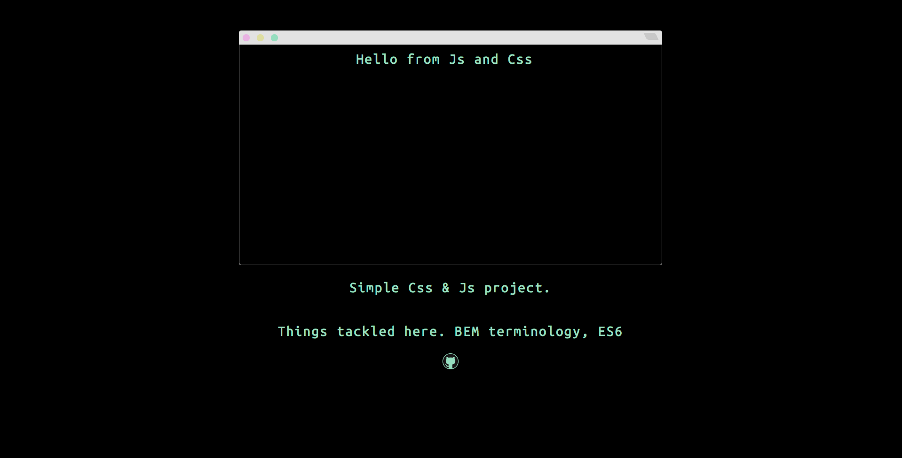

## CSS and JS Browser Window

### README

A simple browser window made with CSS &amp; JS. A Simple `js` and `css` project. See the live version here [cssbrowser](http://cssbrowser.site)

### Install
 Clone on your local machine and run `npm i` or just view the [demo](https://codepen.io/intercoder/pen/84fe8fb5d06335fc1ed0d084474e9aa0) on codepen.

### TODO
- [x] Clean codepen demo - add link
- [x] Publish to github pages
- [x] Add link to github repo
- [x] Add license
- [x] Add domain
- [x] Add gulp task
- [ ] Add Google Analytics
- [ ] Write Case Study
- [ ] Write script to automate publishing gh-pages
- [ ] Publish `TypeIt` function as a `npm package`
- [x] Add pictures to readme

Made with ❤ 2016 Belgium - D/S

